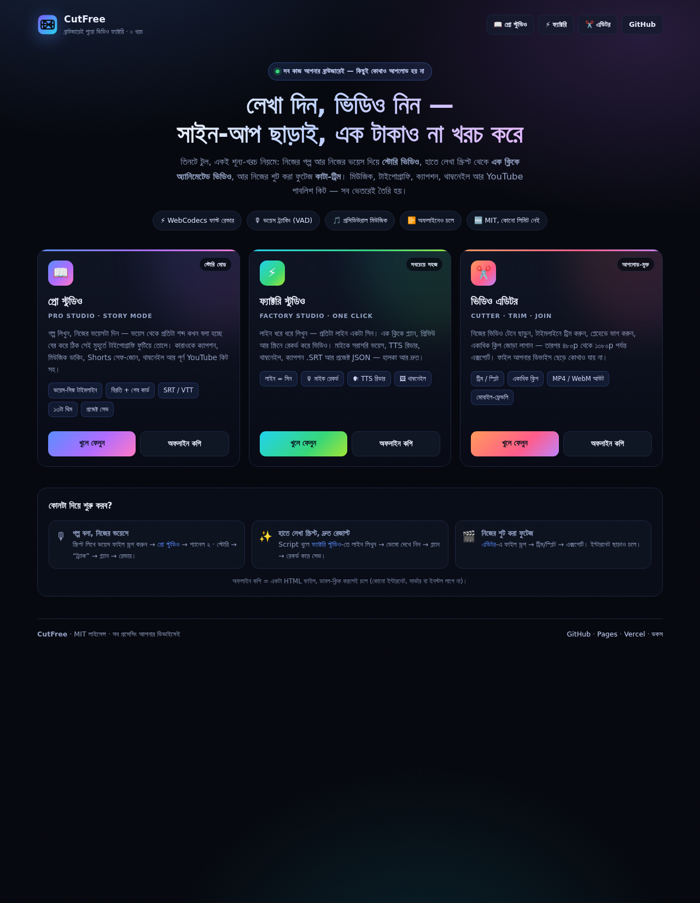
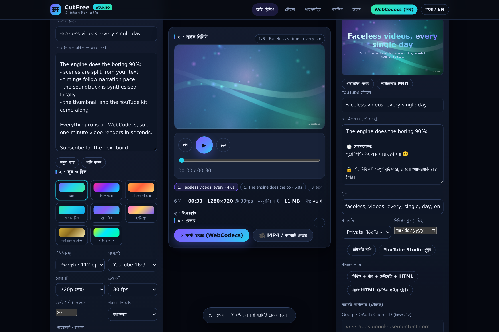
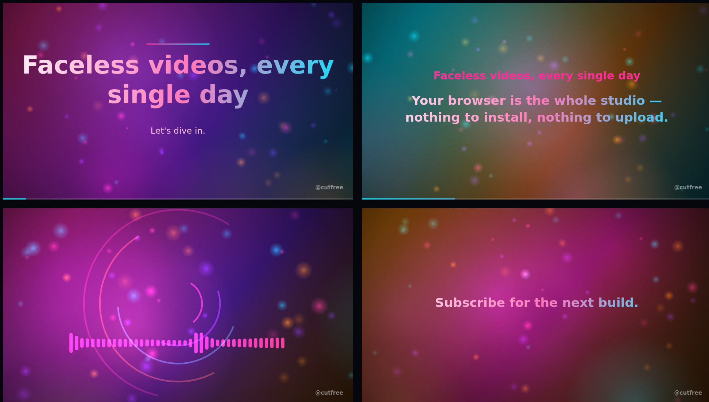
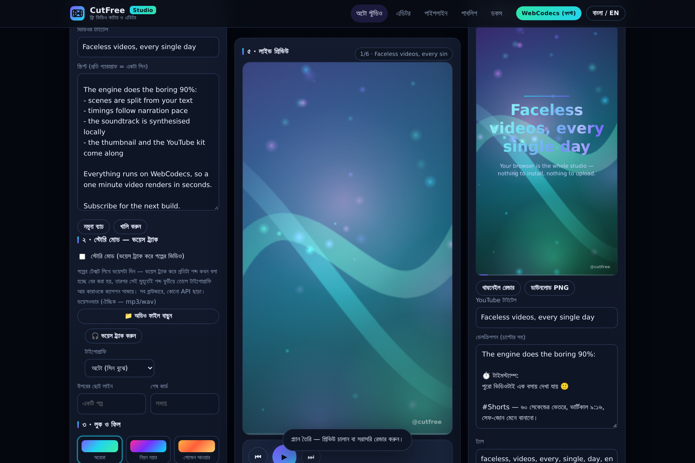
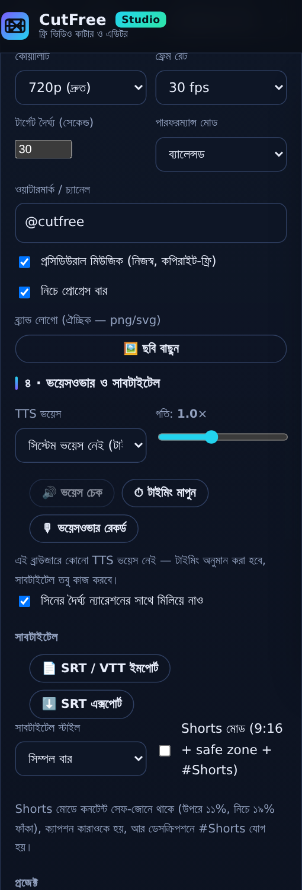
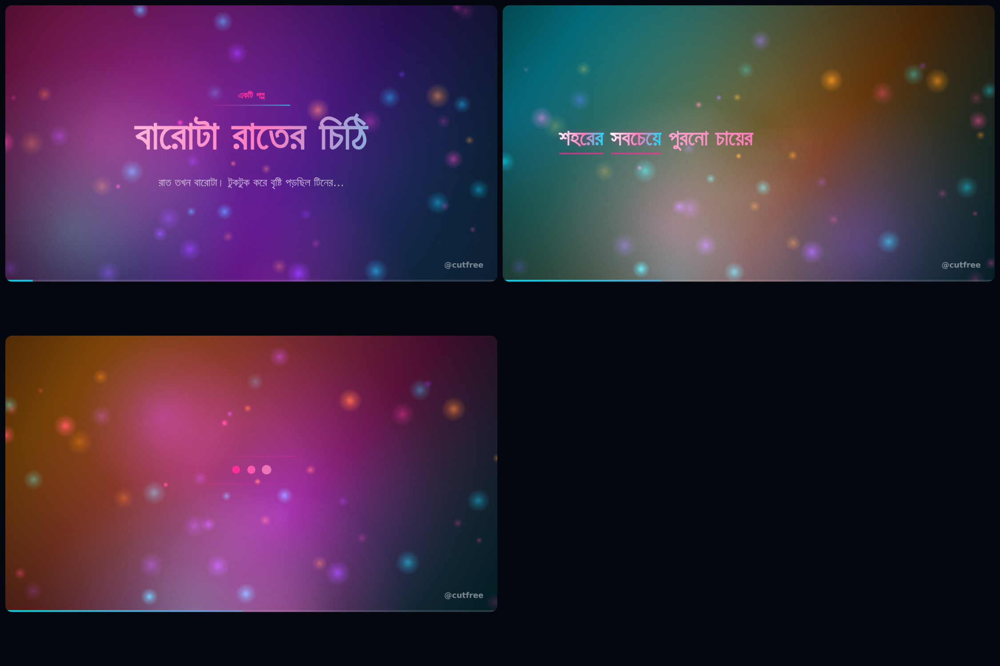
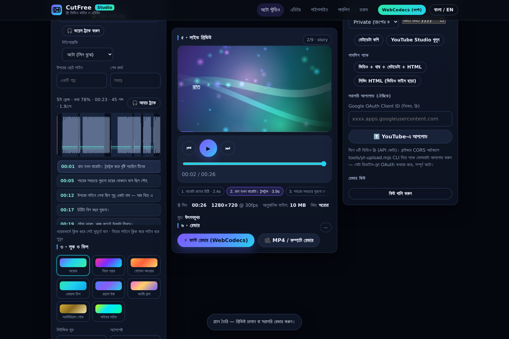

# ⚡ CutFree Studio

**একটা ব্রাউজারেই পুরো ভিডিও ফ্যাক্টরি — শূন্য খরচ, শূন্য সার্ভার, শূন্য কষ্ট।**
লেখা দিন, ভিডিও নিন: অটো-ডিরেক্টর সিন ভাগ করে, WebCodecs দিয়ে ফ্রেম-পারফেক্ট
এনকোড হয়, নিজস্ব মিউজিক সিন্থেসাইজ হয়, থাম্বনেইল + YouTube কিট + শিডিউল তৈরি
হয় — আর পুরো চ্যানেল অটোমেটিক চলতে পারে, এমনকি আপনি ঘুমিয়ে থাকলেও।

<p align="center">
  
  <br><em>হোম পেজ (<code>index.html</code>) — তিনটে টুল, এক জায়গা থেকে</em>
</p>

<p align="center">
  
</p>

<p align="center">
  
  <br><em>এগুলো ইঞ্জিনের আসল আউটপুট ফ্রেম (কোনো ফুটেজ নেই, সব প্রসিডিউরাল)</em>
</p>

<p align="center">
  
  
  <br><em>Shorts মোড (৯:১৬ + সেফ-জোন + কারাওকে ক্যাপশন) আর নতুন ভয়েসওভার/সাবটাইটেল প্যানেল</em>
</p>

<p align="center">
  
  <br><em>স্টোরি মোড: টাইটেল কার্ড → শব্দ-ধরে-শব্দ ফুটে ওঠা লাইন → বিরতি কার্ড → শেষ কার্ড (সব ইঞ্জিনের আসল ফ্রেম)</em>
</p>

---

## 🎯 এক রিপো, তিনটে সারফেস

| | কী | ফাইল | সিঙ্গেল ফাইল |
| --- | --- | --- | --- |
| 🏠 **Hub** | তিনটে টুলের হোম — কার্ড থেকে যেকোনো একটায় | `index.html` | — |
| 📖 **Pro Studio** | স্টোরি মোড (নিজের ভয়েস ট্র্যাক), WebCodecs ফাস্ট রেন্ডার, SRT/VTT, Shorts, YouTube কিট, প্রজেক্ট সেভ/লোড, অফলাইন PWA | `studio-pro.html` | `cutfree-studio-pro.html` |
| ⚡ **Factory Studio** | হালকা এক-পেজ ফ্যাক্টরি: লাইন-বাই-লাইন সিন, এক ক্লিকে ভিডিও, mic/TTS, থাম্বনেইল, SRT, প্রজেক্ট JSON | `studio.html` | `cutfree-studio.html` |
| ✂️ **Editor** | হাতে করা ভিডিও কাটা/ট্রিম/জোড়া লাগানো (আপলোড ছাড়াই) | `editor.html` | `cutfree.html` |

**তিনটেই ১০০% ক্লায়েন্ট-সাইড** — কোনো ডিপেন্ডেন্সি, CDN, ফন্ট বা সার্ভার নেই।

### লাইভ
| হোস্ট | লিংক |
| --- | --- |
| GitHub Pages | <https://khairul990.github.io/cutfree/> · `/studio-pro.html` · `/studio.html` |
| Vercel | <https://cutfree.vercel.app> |

> `app.html` + `src/App.tsx` (React এডিশন) আর `server.ts` আলাদা — ওদের `/api/ai/script`
> রুটের জন্য Node সার্ভার লাগে, তাই স্ট্যাটিক হোস্টে ওটা ডিপ্লয় করা হয় না।
> বাকি সব পেজ সার্ভার ছাড়াই চলে।

### কোনটা কখন
- **নিজের গল্প + নিজের ভয়েস** → Pro Studio (প্যানেল ২ · স্টোরি)।
- **হাতে লেখা স্ক্রিপ্ট, এক ক্লিকে ভিডিও** → Factory Studio।
- **নিজের শুট করা ফুটেজ কাটা** → Editor।

---

## 🚀 ৬০ সেকেন্ডে প্রথম ভিডিও

1. `index.html` (হোম) খুলুন, কার্ড থেকে **প্রো স্টুডিও** বেছে নিন।
2. **“ডেমো স্ক্রিপ্ট বসাও”** চাপুন।
3. **“প্ল্যান বানাও”** → প্রিভিউ চালান (`Space`)।
4. **“⚡ ফাস্ট রেন্ডার (WebCodecs)”** → ভিডিও রেডি।
5. **“ভিডিও + থাম্ব + মেটাডেটা + HTML”** → পুরো পাবলিশ প্যাক এক ফোল্ডারে।

> কোনো সার্ভার ছাড়াই চালাতে? হোমের কার্ডে **“অফলাইন কপি”** বাটন আছে —
> `cutfree-studio-pro.html` / `cutfree-studio.html` / `cutfree.html`
> ডাবল-ক্লিক করলেই পুরো টুল চলে (ফাইল:// থেকেও)।

### স্ক্রিপ্ট লেখার নিয়ম (অটো-ডিরেক্টর এভাবেই পড়ে)

```
প্রথম লাইনটাই ভিডিওর টাইটেল

প্রতিটা প্যারাগ্রাফ = একটা সিন (একটা কাইনেটিক টেক্সট কার্ড)

দুই বা বেশি লাইন যদি এমন হয়:
- এটা একটা বুলেট সিন হবে
- প্রতিটা লাইন আলাদা পয়েন্ট
- প্লাস লাইনগুলো সংখ্যায় থাকলে সিরিয়াল

৯৫% এই লাইনটা স্ট্যাট সিন হবে।

কোনো লাইন “উদ্ধৃতি — লেখক” ফরম্যাটে থাকলে কোট সিন।

---
উপরের `---` দিয়ে আলাদা করলে এটা দ্বিতীয় ভিডিও (ব্যাচ মোড)
```

ডিরেক্টর নিজেই ঠিক করে: সিন টাইপ, দৈর্ঘ্য (ন্যারেশন পেস ধরে), থিম, মিউজিক মুড,
এবং প্রয়োজনে মাঝে মাঝে ব্রোল (নিছক মোশন) বসিয়ে তাল ঠিক রাখে।

---

## ⚙️ ইঞ্জিন ভেতরে কীভাবে কাজ করে

```
স্ক্রিপ্ট ─▶ অটো-ডিরেক্টর ─▶ স্পেক (JSON) ─┬─▶ প্রিভিউ (ক্যানভাস, রিয়েল-টাইম)
                                          ├─▶ মিউজিক (OfflineAudioContext)
                                          └─▶ এনকোডার ─▶ WebM/MP4 ─▶ প্যাক
```

| স্তর | কী করা হয় | কেন এটা আলাদা |
| --- | --- | --- |
| **director.js** | স্ক্রিপ্ট → সিন লিস্ট, টাইমিং, থিম/মুড বাছাই, YouTube মেটাডেটা | একই ইনপুট = একই আউটপুট (সিড-ভিত্তিক, ডিটারমিনিস্টিক) |
| **engine.js** | `renderAt(t)` — প্রতিটা ফ্রেম সময়ের ফাংশন | প্রিভিউ আর এক্সপোর্ট **হুবহু এক**; যেকোনো সময়ের ফ্রেম থাম্বনেইল করা যায় |
| **music.js** | প্যাড, বেস, আর্প, ড্রাম, রিভার্ব সিন্থেসিস + ভয়েসওভার ডাকিং | ১০০% কপিরাইট-ফ্রি, যেকোনো দৈর্ঘ্যে; এনার্জি প্রোফাইল ভিজ্যুয়াল চালায় |
| **muxer.js** | নিজের লেখা WebM/EBML মিউক্সার (VP8/VP9 + Opus) | WebCodecs যে কাঁচা চাঙ্ক দেয় সেটা কন্টেইনারে প্যাক করা: কোনো wasm, কোনো CDN |
| **encode.js** | WebCodecs ফাস্ট পাথ + MediaRecorder কম্প্যাট পাথ | GPU এনকোডার থাকলে সেকেন্ডে render; নাহলে everywhere-চলে পথ |
| **publish.js** | থাম্বনেইল, metadata.json, chapters, player.html, **লিভিং HTML** | পাবলিশ প্যাক এক ফোল্ডারে; তারপর CLI বা ব্রাউজার আপলোড |

### পারফরম্যান্স (মাপা, হেডলেস Chromium, GPU ছাড়া)

| মোড | 720p | 1080p |
| --- | --- | --- |
| high (ডেস্কটপ) | ~১২ ms/ফ্রেম → ৮০ fps | ~২৭ ms/ফ্রেম → ৩৭ fps |
| balanced | ~১০ ms/ফ্রেম | ~২৫ ms/ফ্রেম |
| fast (ফোন/লম্বা ভিডিও) | ~১০ ms/ফ্রেম | ~২১ ms/ফ্রেম |

ব্লেন্ড করা অরোরা লেয়ার আউটপুটের ৩০–৩৮% রেজোলিউশনে রেন্ডার হয় তারপর আপস্কেল
হয় (লো-ফ্রিকোয়েন্সি গ্রাফিক্স, তাই চোখে পার্থক্য নেই কিন্তু খরচ ৪× কম); গ্লো
স্প্রাইট একবার বেক হয়; ভিনিয়েট ছোট ক্যানভাসেই বসে; ট্রানজিশনের বাইরে লেয়ার
রাউন্ড-ট্রিপ একেবারে বাদ। রেন্ডার ফোনেও চলে, কারণ ফোনের ব্রাউজারে WebCodecs +
`VideoFrame(canvas)` কাজ করে।

---

## 📺 YouTube — ফ্রি অটো আপলোড (দুটো পথ)

### পথ ১ — ব্রাউজার থেকে সরাসরি (স্টুডিওর “আপলোড” বাটন)

নিজের Google OAuth Client ID লাগবে (ফ্রি): Cloud Console → YouTube Data API v3
এনাবল → OAuth consent screen → Credentials → **Web application** → Authorized
JavaScript origins-এ আপনার সাইটের URL দিন → Client ID কপি করে স্টুডিওর বক্সে দিন।

### পথ ২ — CLI (সুপারিশ করা, সম্পূর্ণ অটো, CORS সমস্যা নেই)

```bash
# একবারের সেটআপ (২ মিনিট, ফ্রি)
#  1. console.cloud.google.com → নতুন প্রজেক্ট
#  2. APIs & Services → Library → "YouTube Data API v3" → Enable
#  3. OAuth consent screen → External → নিজেকে test user হিসেবে যোগ করুন
#  4. Credentials → Create credentials → OAuth client ID
#     → Application type: "TVs and Limited Input devices"   ← এটাই আসল ট্রিক
node tools/yt-upload.mjs login --client-id <YOUR_ID> --client-secret <SECRET>

# তারপর স্টুডিওর প্যাক ফোল্ডার দিলেই হবে
node tools/yt-upload.mjs upload --dir ./publish --privacy private --limit 6
node tools/yt-upload.mjs status
```

CLI যা করে: **resumable upload** (4MB চাঙ্ক, নেট গেলেও চালু থাকে), থাম্বনেইল সেট,
`publishAt` শিডিউল, `.cutfree-uploads.json`-এ মনে রাখে (দুবার পোস্ট হবে না),
আর ফ্রি কোটা শেষ হলে ভদ্রভাবে থেমে যায়।

> **কোটা:** YouTube Data API ফ্রি ১০,০০০ ইউনিট/দিন; এক আপলোড = ১,৬০০ ইউনিট
> → দিনে **৬টা ভিডিও**, কোনো খরচ নেই। কোটা রিসেট হয় Pacific সময় রাত ১২টায়।

### cron দিয়ে পুরো চ্যানেল অটো

```bash
0 9 * * *  cd /path/to/cutfree && node tools/yt-upload.mjs upload --dir ./publish >> yt.log 2>&1
```

### “লিভিং HTML” — ভিডিও ফাইল ছাড়াই ভিডিও

পাবলিশ প্যাকে একটা `*.animation.html` থাকে: ইঞ্জিন + স্পেক + মিউজিক সব ওই একটা
ফাইলেই এমবেড করা। ব্রাউজারে খুললে অ্যানিমেশন নিজে নিজে চলে, যেকোনো রেজোলিউশনে
ক্রিস্প — অর্থাৎ ভিডিও ফাইল, এনকোডিং বা ডিস্ক স্পেস কিছুই লাগে না।

---

## 📖 স্টোরি মোড (২.২) — নিজের গল্প, নিজের ভয়েস

> 📄 এই প্যানেলটা এখন **`studio-pro.html`** পেজে (সিঙ্গেল ফাইল: `cutfree-studio-pro.html`) —
> ল্যান্ডিং পেজ আর ফ্যাক্টরি স্টুডিওর হেডার থেকে এক ক্লিকে পৌঁছে যাবেন।

আপনি শুধু গল্পটা লেখেন আর ভয়েসটা দেন — বাকিটা টুল করে দেয়: **ভয়েস ট্র্যাক করে
প্রতিটা শব্দ কখন বলা হচ্ছে বের করা হয়**, তারপর ঠিক সেই মুহূর্তে শব্দ ভেসে ওঠে পর্দায়।
আর কোনো API নেই, কোনো খরচ নেই — অ্যালাইনমেন্টও আপনার ব্রাউজারেই চলে।

<p align="center">
  
</p>

### ভেতরে যা হয়
| স্তর | কী করে |
| --- | --- |
| **`align.js` — VAD** | ৩০ ms উইন্ডো / ১০ ms হপে RMS, percentile নয়েজ-ফ্লোর + hysteresis → ফ্রেজ (কথার অংশ), গ্যাপ আর খালি/কথার অনুপাত বের করে |
| **মাত্রা-সচেতন শব্দ** | বাংলা যুক্তাক্ষর/মাত্রা ধরে প্রতি শব্দের ওজন (দণ্ড `।` = ০.৩৪ s, কমা = ০.১৭ s) → লেখা কত সময় নেবে তার হিসাব |
| **শব্দ ↔ ভয়েস বসানো** | প্রতিটা প্যারাগ্রাফ একটা ফ্রেজের সাথে বাঁধা; ভেতরের শব্দগুলো ওজন-অনুপাতে বসে, ফ্রেজ শেষ হওয়ার আগেই থামে — তাই **নীরবতা কখনো লেখায় ভরে যায় না** |
| **`story.js` — টাইমলাইন** | প্যারাগ্রাফ = সিন (≤১১ শব্দ / ৫.২ s), সিনগুলো **পিঠোপিঠি** — ফাঁকা ফ্রেম নেই; বড় বিরতি পেলে সেখানে **বিরতি কার্ড**, শেষে শেষ কার্ড + CTA |
| **ভয়েস-শিফট** | টাইটেল কার্ড যতটা সময় নেয়, ততটা পুরো স্টোরি (স্ক্রিন-টেক্সট + ক্যাপশন + SRT) একসাথে সরানো হয় — লিপ-সিঙ্ক কখনো ভাঙে না |

### স্টুডিওতে
- প্যানেল **২ · স্টোরি**-তে “স্টোরি মোড” টিক দিন → টেক্সটএরিয়া যা লেখা তাই গল্প (টাইটেল লাইন আলাদা করার ঝামেলা নেই, চাইলে টাইটেল লিখে দিন)।
- **ভয়েস ফাইল ড্রপ করলেই অটো-ট্র্যাক** — নিচে ওয়েভফর্ম, ক্যাপশন বার, প্যারাগ্রাফ টিক আর প্লেহেড সহ টাইমলাইন; ক্যানভাসে ক্লিক করলে অডিও **ঠিক সেই মুহূর্তে** বাজে।
- চিপে চিপে প্রতিটা লাইনের শুরুর সময়; স্ট্যাটস: ফ্রেজ সংখ্যা, কথা-কত-ভাগ, মোট সময়, শব্দ/সেকেন্ড।
- ভয়েস না দিলেও চলে (লেখার গতিতে অনুমান), আর **নিজের SRT দিলে সেটাই প্রাধান্য পায়** — স্টোরির লাইন তখন ক্যাপশন বার চাপা দেয় না।
- টাইপোগ্রাফি স্টাইল ৪টা: `reveal` (শব্দ ভেসে ওঠে), `typewriter`, `board` (স্টোরিবুক প্যানেল), `stack` (টেলিপ্রম্পটার)।

## ✂️ ক্যাপশন নিজে হাতে ঠিক করুন (২.৪)

টাইমলাইনের ক্যাপশন বারগুলো এখন **টেনে এডিট করা যায়** — ভয়েস আবিষ্কার করে যে টাইমিং দিয়েছে,
সেটা সোনার মতো বসে গেলে হাত দিয়ে ঠিক করার সুযোগ থাকে।

| কী | কীভাবে |
| --- | --- |
| **কিউ সরানো** | ক্যাপশনের **শেষ প্রান্ত** ধরে টানুন (কার্সর `ew-resize` হয়ে যায়) — শুরু ওখানেই পেরেক দেওয়া থাকে, তাই লাইন কখনো আগের লাইনের উপর চড়ে বসে না |
| **নাড়ানো** | বার/চিপে একবার ক্লিক করে সিলেক্ট → **← / →** = ০.২ s, **Shift** চেপে = ০.০৫ s |
| **রিডআউট** | `Caption 00:12 → 00:15 (2.9s) · ←/→ to nudge` — কোন লাইনটা হাতে আছে, সেটাই বলে দেয় |

এডিট করার সাথে সাথেই পুরো চেইন সরে যায়: **স্ক্রিনের টাইপোগ্রাফি → সিন প্ল্যান → স্ক্রাববার
(ঠিক ১০০০ ধাপ, আগে মাত্র ১০% স্ক্রাব হতো) → বার্ন-ইন বার → এক্সপোর্ট করা SRT**।
ক্যাপশন বার এখন **ইচ্ছে করলেই** — টিক না দিলে বা ক্যাপশন ফাইল না দিলে কিছু বার্ন হয় না,
আর স্টোরি মোডে যে লাইনটা ভয়েস বলছেই সেটার নিচে আবার বার বসে না।

লেখার বাইরে টেক্সট সরাতে চাইলে **টেক্সট শিফট** স্লাইডার (−০.৪ s … +০.৮ s) —
শুধু অন-স্ক্রিন লেখা সরে, অডিও বা কিউ ছোঁয় না, তাই লিপ-সিঙ্ক ভাঙে না।

## 🎙 ভয়েসওভার, সাবটাইটেল, Shorts, প্রজেক্ট (২.১)

চারটাই একই স্টুডিওতে, একই শূন্য-খরচ নিয়মে — কোনো API key, কোনো সার্ভার, কোনো আপলোড নেই।

### ভয়েসওভার — ব্রাউজারেই
| ধাপ | কী হয় |
| --- | --- |
| **ভয়েস চেক** | সিস্টেম TTS ভয়েসে স্ক্রিপ্টের প্রথম লাইন শোনায়, গতি স্লাইডারে ০.৬–১.৬× |
| **টাইমিং মাপুন** | `speechSynthesis.onboundary` দিয়ে **শব্দ-ধরে** টাইমিং নেয় → সিনের দৈর্ঘ্য ন্যারেশনের সাথে মিলে যায় (`fitToNarration`), ক্যাপশনও এই টাইমিং থেকেই তৈরি |
| **ভয়েসওভার রেকর্ড** | Chrome/Edge-এ “এই ট্যাব শেয়ার + tab audio” দিয়ে TTS-এর অডিও ধরে `MediaRecorder` → পুরো ন্যারেশন এক ফাইলে, গানের সাথে **অটো-ডাকিং** সহ মিক্স |

ভয়েস না থাকলে বা ক্যাপচার না দিলেও কিছু ভাঙে না — টাইমিং অনুমান করে এগিয়ে যায়
(“টাইমিং অনুমান করা হয়েছে”), আর ক্যাপশন কাজ করে। Gboard/অন্য টুলে বানানো
mp3/wav আগের মতোই আপলোড করা যায়।

### সাবটাইটেল বার্ন-ইন
- **SRT / VTT ইমপোর্ট** (বা TTS টাইমিং থেকে অটো), **SRT এক্সপোর্ট** — YouTube-এ আলাদা ক্যাপশন ফাইল দিতেও কাজে লাগে।
- দুই স্টাইল: **কারাওকে** (শব্দ-বাই-শব্দ হাইলাইট) আর **সিম্পল বার**; প্লেট, গ্রেডিয়েন্ট বর্ডার ও সেফ-এরিয়া মেনে বসে।
- লম্বা লাইন ভেঙে দুই লাইনে (৪২ ক্যারেক্টার র্যাপ), লেখা কখনো ফ্রেমের বাইরে যায় না।

### Shorts মোড (৯:১৬)
`Shorts মোড` টিক দিলেই: অ্যাসপেক্ট **৯:১৬**, দৈর্ঘ্য **≤৫৮ সেকেন্ড**, ক্যাপশন কারাওকে,
কনটেন্ট **সেফ-জোনে** (উপরে ১১% / নিচে ১৯% ফাঁকা — YouTube-এর UI কখনো লেখা ঢাকে না),
আর ডেসক্রিপশনে **#Shorts** — টাইটেলও ৯০ ক্যারেক্টারে ছাঁটা।

### প্রজেক্ট সেভ/লোড + PWA
- **`*.cutfree.json`**: স্ক্রিপ্ট, থিম, মুড, অ্যাসপেক্ট, কোয়ালিটি, পারফ মোড, ক্যাপশন,
  মাপা টাইমিং, Shorts ফ্ল্যাগ — সব এক ফাইলে। টিম শেয়ার বা কাল আবার খুলে চালানো যায়।
- **PWA**: `manifest.webmanifest` + `sw.js` — একবার লোড হলে স্টুডিও **অফলাইনেও** চলে
  (এঞ্জিন থেকে এনকোডার পর্যন্ত পুরো শেল ক্যাশ হয়; অ্যাপের মতো ইনস্টলও করা যায়)।

### ট্রানজিশন লাইব্রেরি — ১১টা
`fade · slide · zoom · wipe · glitch` + **`maskCircle` · `maskBox` · `pageTurn` · `blurZoom` · `whipPan` · `bars`**
(মাস্ক ওয়াইপ, পেজ-টার্ন, হুইপ-প্যান, বার্ন-ইন বার)। প্রতিটা ট্রানজিশন শুধু **exit**-এ চলে,
তাই কোনো ফ্রেমে দুটো সিন একসাথে ব্লিড করে না (আগের ক্রস-ডিসলভ ওভারল্যাপ বাগটা আর নেই)।

---

## 🧪 টেস্ট

```bash
npm i -D playwright && npx playwright install chromium
npm test              # এডিটর (index.html): ৩০টা চেক
npm run test:factory  # Factory Studio (studio.html): ১৫টা চেক
npm run test:studio   # Pro Studio (studio-pro.html): ১২১টা চেক
npm run test:all

PAGE=cutfree-studio-pro.html npm run test:studio   # সিঙ্গেল-ফাইল বিল্ডের বিরুদ্ধে
PAGE=cutfree-studio.html npm run test:factory
```

**Factory Suite** ঠিক যা যাচাই করে: পেজ ওঠে (কোনো এরর ছাড়া) → ডেমো স্ক্রিপ্ট →
প্ল্যান (সিন/দৈর্ঘ্য/টাইমলাইন) → ক্যানভাস সত্যিই আঁকে ও সময়ের সাথে বদলায় →
টাইমলাইনে ক্লিক করে স্ক্রাব → প্লে ঘড়ি এগোয় → থাম্বনেইল PNG (আসল PNG সিগনেচার,
সাইজ) → SRT → প্রজেক্ট JSON — আর শেষে **অডিও শিডিউলার কোনো এরর ছোড়ে কি না**
(`setValueAtTime` নেগেটিভ টাইম বাগটার রিগ্রেশন গার্ড)।

স্টুডিও টেস্ট আসলেই যা যাচাই করে: সিন স্প্লিটিং → মিউজিক (audible + নরমালাইজড
এনার্জি) → রেন্ডারার ডিটারমিনিস্টিক (একই t = একই পিক্সেল, ভিন্ন t = ভিন্ন) →
**WebCodecs render → আমাদের মিউক্সার → ফাইলটা আসলেই VP9+Opus সহ প্লে-যোগ্য কি না**
(ডিউরেশন/রেজোলিউশন/সাইজ মিলিয়ে) → MediaRecorder কম্প্যাট পথ → থাম্বনেইল/মেটাডেটা/
চ্যাপ্টার/শিডিউল/লিভিং HTML → এবং ২ ভিডিওর ব্যাচ কিউ UI।

২.১-এর নতুন চেকগুলো আসল UI ক্লিক করে চালানো: SRT পার্স/বিল্ড/রাউন্ড-ট্রিপ, ক্যাপশন
সেফ-এরিয়ায় বসে কি না (পিক্সেল গুনে), ১১টা ট্রানজিশনের ফ্রেম একে অন্যের থেকে আলাদা
কি না, টাইমিং মাপা → প্ল্যান রিবিল্ড, SRT এক্সপোর্ট ডাউনলোড, Shorts টগল → ৯:১৬ প্রিভিউ,
প্রজেক্ট সেভ → লোড করে ফর্ম ফেরত, service worker + manifest, আর **বাংলা/ইংরেজি
কোনো স্ট্রিং কাঁচা key হিসেবে পড়ে আছে কি না** — দুটো ভাষাতেই অটো-চেক।

২.৪-এর চেক (§4m) আসল মাউস-ড্র্যাগ চালায়: গল্পের প্ল্যান লোড হওয়া পর্যন্ত অপেক্ষা করে,
**শেষ ক্যাপশনের শেষ প্রান্ত** ধরে টেনে দেয় (শুরু নড়ে কি না দেখে), এক্সপোর্ট করা SRT একই
সাথে বদলায় কি না মেলে, **←** চাপলে +০.২ s যায় কি না দেখে, টিক দিলে নিচের তৃতীয় অংশে
আসলেই ক্যাপশন বার আঁকা হয় কি না পিক্সেল গুনে, আর রেন্ডারার সেই ফ্রেমটা **কোনো এরর ছাড়া**
আঁকে কি না — এই শেষ চেকটাই একটা আসল বাগ ধরেছিল (টাইপরাইটার কার্সেট `ctx` ছাড়াই আঁকতে গিয়ে
থ্রো করত, ক্যানভাস চুপচাপ আগের ফ্রেম ধরে রাখত)।

স্টোরি মোড (২.২) আলাদা করে যাচাই হয়: VAD ঠিক জায়গায় ফ্রেজ পায় কি না, প্রতিটা প্যারাগ্রাফ
ফ্রেজের শুরুতে বসে কি না, **১.৭ সেকেন্ডের নীরবতায় কোনো শব্দ ঢুকে পড়ে কি না**, বিরতি কার্ড
তৈরি হয় কি না, টাইপোগ্রাফি ফ্রেম-বাই-ফ্রেম বদলায় কি না, কারাওকে কিউ ভয়েস-শিফটের সাথে
হুবহু থাকে কি না, স্টোরির লাইনে ডুপ্লিকেট ক্যাপশন বার নেই কি না, আর পুরো UI ফ্লো
(WAV ড্রপ → অটো-ট্র্যাক → প্ল্যান → প্রিভিউ প্লে → SRT এক্সপোর্ট → ক্লাসিক মোডে ফেরা)।

---

## 📁 ফাইল স্ট্রাকচার

```
cutfree/
├── index.html                                  # 🏠 হোম (তিনটে টুলের কার্ড)
├── studio-pro.html  / cutfree-studio-pro.html   # 📖 প্রো স্টুডিও (স্টোরি মোড + WebCodecs + কিট)
├── studio.html      / cutfree-studio.html       # ⚡ ফ্যাক্টরি স্টুডিও (এক-পেজ, লাইন-বাই-লাইন)
├── editor.html      / cutfree.html              # ✂️ কাটার/এডিটর
├── app.html · src/ · server.ts · vite.config.ts # React এডিশন (Node সার্ভার দরকার)
├── css/style.css · css/studio.css
├── js/
│   ├── app.js · i18n.js                # এডিটর + দুই ভাষার স্ট্রিং
│   └── studio/
│       ├── themes.js   # থিম, মিউজিক মুড, ব্লেন্ড রেসিপি
│       ├── engine.js   # রেন্ডারার: কাইনেটিক টাইপোগ্রাফি, স্টোরি সিন, ট্রানজিশন
│       ├── music.js    # প্রসিডিউরাল মিউজিক + ভয়েস ডাকিং + এনার্জি
│       ├── muxer.js    # নিজের WebM/EBML মিউক্সার
│       ├── encode.js   # WebCodecs ফাস্ট পাথ + MediaRecorder কম্প্যাট
│       ├── director.js # স্ক্রিপ্ট → সিন প্ল্যান + YouTube মেটাডেটা
│       ├── captions.js # SRT/VTT পার্স-বিল্ড, clampTo, কারাওকে কিউ
│       ├── voice.js    # TTS ভয়েস, শব্দ-ধরা টাইমিং, ট্যাব-অডিও রেকর্ডিং
│       ├── align.js    # VAD + শব্দ-টাইমিং অ্যালাইনমেন্ট (স্টোরি মোডের ইঞ্জিন)
│       ├── story.js    # স্ক্রিপ্ট + ভয়েস → স্টোরি সিন, বিরতি কার্ড, ক্যাপশন
│       ├── publish.js  # থাম্বনেইল, প্যাক, লিভিং HTML, ব্রাউজার আপলোড
│       └── ui.js       # প্রো স্টুডিওর ওয়ার্কবেঞ্চ
├── tools/
│   ├── build-single-file.js   # সিঙ্গেল-ফাইল বিল্ড (৩ পেজ)
│   ├── build.js               # পুরো প্রোডাকশন বিল্ড (dist/ + server.cjs)
│   ├── yt-upload.mjs          # CLI আপলোডার (ডিভাইস-ফ্লো OAuth)
│   └── studio-shots.js        # ডকস স্ক্রিনশট
├── sw.js · manifest.webmanifest        # PWA / অফলাইন শেল
├── tests/e2e.cjs · factory.e2e.cjs · studio.e2e.cjs
├── .github/workflows/pages.yml         # GitHub Pages ডিপ্লয় (_site/)
└── Dockerfile · vercel.json
```

---

## 🌍 হোস্ট করা

```bash
python3 -m http.server 8080          # লোকালি
docker build -t cutfree . && docker run -p 8080:80 cutfree   # নিজের সার্ভার
```

GitHub-এ পুশ করলেই `.github/workflows/pages.yml` Pages-এ ডিপ্লয় করে
(<https://khairul990.github.io/cutfree/>) — শর্ত একটাই: Settings → Pages →
Source: **GitHub Actions** চালু থাকতে হবে। Vercel-এর সাথে রিপোটা আগেই জোড়া
(<https://cutfree.vercel.app>), পুশ করলেই ডিপ্লয় হয়। Netlify/Cloudflare-এ
ফোল্ডার ড্রপ করলেও চলবে।

> **নোট:** `.github/workflows/` ফাইল বদলাতে `workflow` স্কোপ সহ টোকেন লাগে।
> `tools/ci/pages-workflow.clean.yml` ফাইলে একটা পরিষ্কার ওয়ার্কফ্লো রাখা আছে
> (পুরো রিপোর বদলে শুধু স্ট্যাটিক ফাইল আপলোড করে) — ইচ্ছে হলে হাতে কপি করে দিলেই হয়।

---

## ⚠️ সীমাবদ্ধতা (সৎভাবে)

- WebCodecs ছাড়া ব্রাউজারে (পুরনো Safari, Firefox Android) অটো-ফলব্যাক হয়
  MediaRecorder পথে — তখন রেন্ডার রিয়েল-টাইমে হয় (ভিডিওর দৈর্ঘ্যের সমান সময়)।
- MP4 আউটপুট ব্রাউজারের উপর নির্ভরশীল: Chrome/Edge-এ MP4 হয়, Firefox-এ সাধারণত WebM।
  YouTube দুটোই নেয়।
- কাস্টম থাম্বনেইল সেট করতে চ্যানেল ভেরিফায়েড থাকতে হবে (না হলে YouTube বাদ দেয়)।
- অটো-ডিরেক্টর টেক্সট-ভিত্তিক — ক্যামেরা ফুটেজ, ভয়েস-ক্লোনিং বা AI ছবি এতে নেই;
  চাইলে ভয়েসওভার ফাইল দিতে পারবেন (অটো-ডাকিং সহ মিক্স হবে)।
- TTS ভয়েস আসে **আপনার ডিভাইস থেকে** — লিনাক্স/হেডলেস ব্রাউজারে প্রায়ই কিছু থাকে না,
  Windows/macOS/Android-এ ভালো সিলেকশন থাকে। ভয়েস না পেলে টাইমিং অনুমান হয়।
- ট্যাব-অডিও ক্যাপচার (`getDisplayMedia`) ডেস্কটপ Chrome/Edge-এ কাজ করে; iOS Safari-তে
  নেই — সেখানে mp3/wav আপলোড বা শুধু মাপা টাইমিং ব্যবহার করুন।

## 🗺️ রোডমাপ

- [x] ট্রানজিশন লাইব্রেরি বাড়ানো — ১১টা (মাস্ক/ওয়াইপ, পেজ-টার্ন, হুইপ-প্যান, bars) → ২.১
- [x] সাবটাইটেল বার্ন-ইন (SRT/VTT ইমপোর্ট + SRT এক্সপোর্ট + কারাওকে) → ২.১
- [x] TTS ইন্টিগ্রেশন (ব্রাউজার `speechSynthesis` মেপে/রেকর্ড করে ভয়েসওভার) → ২.১
- [x] ৯:১৬ Shorts + সেফ-জোন + #Shorts মেটাডেটা → ২.১
- [x] প্রজেক্ট JSON সেভ/লোড → ২.১
- [x] PWA + অফলাইন ক্যাশ (`sw.js` + manifest) → ২.১
- [x] স্টোরি মোড — ভয়েস-ট্র্যাকড টাইপোগ্রাফি, বিরতি কার্ড, অ্যালাইন টাইমলাইন → ২.২
- [x] টাইমলাইনে ক্যাপশন এডিট (ড্র্যাগ + ←/→ নাজ, SRT/প্ল্যান/বার্ন-ইন সব একসাথে) → ২.৪
- [ ] একাধিক ভয়েস দিয়ে সিন-ভিত্তিক ট্র্যাক + ব্যাকগ্রাউন্ড মিউজিক ভলিউম ডায়াল
- [ ] WebCodecs `AudioEncoder` দিয়ে ভয়েসওভার সরাসরি মিক্স (মাঝের M4A ধাপ বাদ)

## 📄 লাইসেন্স

[MIT](LICENSE) — ব্যবহার করুন, ফর্ক করুন, নিজের চ্যানেল চালান। ক্রেডিট রাখলে খুশি হব 🙂

<sub>**ট্যাগ:** faceless channel automation · browser video generator · zero cost video production ·
WebCodecs · WebM muxer · procedural music · kinetic typography · free video maker · YouTube automation ·
প্রসিডিউরাল ভিডিও · অটো ভিডিও তৈরি · ইউটিউব অটোমেশন · কাটফ্রি স্টুডিও</sub>
