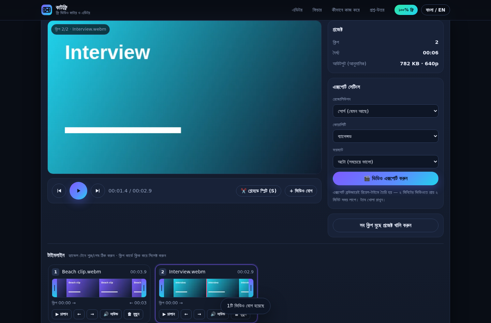

# ✂️ CutFree — ফ্রি অনলাইন ভিডিও কাটার ও এডিটর

**CutFree** একটা ১০০% ফ্রি, ওপেন-সোর্স ভিডিও কাটার/ট্রিমার/জয়নার যা পুরোপুরি আপনার
ব্রাউজারে চলে। কোনো আপলোড নেই, কোনো সার্ভার নেই, কোনো সাইন-আপ নেই, কোনো ওয়াটারমার্ক
নেই — আপনার ভিডিও কখনও ডিভাইস ছেড়ে কোথাও যায় না।

<p align="center">
  
</p>

> **দ্রুত শুরু:** `index.html` ব্রাউজারে খুলুন — অথবা জিরো-সেটআপ চাইলে
> সিঙ্গেল-ফাইল বিল্ড `cutfree.html` ডাউনলোড করে ডাবল-ক্লিক করুন।

---

## ✨ ফিচার

| ফিচার | বিবরণ |
| --- | --- |
| ✂️ ট্রিম | টাইমলাইনের হ্যান্ডেল টেনে যেকোনো ক্লিপের শুরু/শেষ ঠিক করুন (লাইভ প্রিভিউ সহ) |
| 🔪 স্প্লিট | প্লেহেডে `S` চেপে (বা বাটনে ক্লিক) ক্লিপ দুই ভাগে ভাগ করুন |
| 🧩 জোড়া লাগানো | একাধিক ভিডিও/অডিও ট্র্যাক যোগ করে সিরিয়ালি জোড়া লাগিয়ে একটাই ভিডিও এক্সপোর্ট করুন |
| 🎚️ এক্সপোর্ট সেটিংস | 480p / 720p / 1080p / সোর্স রেজোলিউশন · ৩টি কোয়ালিটি প্রিসেট · MP4 বা WebM |
| 🔊 অডিও কন্ট্রোল | প্রতিটি ক্লিপ আলাদাভাবে mute করা যায়; অডিও ভিডিওর সাথে সিঙ্কে জোড়া লাগে |
| 🔒 প্রাইভেট | ফাইল কখনও আপলোড হয় না — সব প্রসেসিং লোকাল, ইন্টারনেট ছাড়াও চলে |
| 🌐 বাংলা + ইংরেজি | হেডারের টগল দিয়ে ভাষা বদলানো যায় (পছন্দ ব্রাউজারে সেভ থাকে) |
| 📱 রেসপন্সিভ | ফোন, ট্যাব, ডেস্কটপ — সবখানে একই ইঞ্জিন |
| 💸 সত্যিই ফ্রি | কোনো লিমিট, পে-ওয়াল, ট্রায়াল বা ওয়াটারমার্ক নেই |

---

## 🚀 কীভাবে ব্যবহার করবেন

1. `index.html` (বা `cutfree.html`) ব্রাউজারে খুলুন।
2. **ভিডিও যোগ করুন** — ফাইল ড্রপ করুন বা “ভিডিও যোগ করুন” বাটন দিয়ে একসাথে অনেকগুলো ফাইল বেছে নিন।
3. **কাটুন** — ক্লিপ কার্ডের দুই পাশের হ্যান্ডেল টেনে ট্রিম করুন, প্লেহেডে `S` চেপে স্প্লিট করুন,
   `←/→` দিয়ে ক্লিপের ক্রম বদলান, `🗑` দিয়ে এক ক্লিপ মুছুন।
4. **এক্সপোর্ট করুন** — রেজোলিউশন/কোয়ালিটি/ফরম্যাট বেছে `🎬 ভিডিও এক্সপোর্ট করুন` চাপুন।
   প্রোগ্রেস ১০০% হলে ফাইল নিজে থেকেই ডাউনলোড হবে।

### কীবোর্ড শর্টকাট

| কী | কাজ |
| --- | --- |
| `Space` | প্লে / পজ |
| `S` | প্লেহেডে ক্লিপ স্প্লিট |
| `←` / `→` | আগের / পরের ক্লিপ |
| `Delete` / `Backspace` | সিলেক্ট করা ক্লিপ মুছে ফেলা |

💡 ডিবাগ করতে চান? URL-এর শেষে `?debug=1` যোগ করুন — কনসোলে `window.cfDebug()` দিয়ে
পুরো এডিটর স্টেট ও কোডেক সাপোর্ট দেখতে পাবেন।

---

## 🛠️ কীভাবে কাজ করে (টেকনিক্যাল)

- **ট্রিম/প্রিভিউ:** প্রতিটি ক্লিপের `start`/`end` টাইমস্ট্যাম্প রাখা হয়; প্রিভিউ `<video>`
  এলিমেন্টে প্লেব্যাকের সময় `requestAnimationFrame` দিয়ে প্লেহেড ও টাইমলেবেল আপডেট হয়,
  এবং ক্লিপ শেষ হলে পরের ক্লিপে নিজে থেকে চলে যায়।
- **এক্সপোর্ট:** একটা `<canvas>`-এ ক্লিপের প্রতিটি ফ্রেম রিয়েল-টাইমে আঁকা হয়, তারপর
  `canvas.captureStream(30)` + `MediaRecorder` দিয়ে এনকোড হয়। অডিও আসে
  `AudioContext → MediaStreamDestination` থেকে, তাই mute করা ক্লিপ নীরব থাকে এবং
  অডিও-ভিডিও সিঙ্ক ঠিক থাকে। এক্সপোর্টের আগে রেকর্ডার `pause()` করে রাখা হয় যাতে
  ক্লিপের মাঝের গ্যাপ ফাইলে না ঢোকে।
- **বিটরেট:** প্রতি ফ্রেমে বাইট-পার-পিক্সেল (BPP) হিসাব করে ফাইল সাইজ অনুমান দেখানো হয়,
  আউটপুট রেজোলিউশন+কোয়ালিটি অনুযায়ী।
- **ফরম্যাট নেগোশিয়েশন:** `MediaRecorder.isTypeSupported()` দিয়ে সেরা কোডেক বেছে নেওয়া হয়
  (Chrome/Edge-এ সাধারণত `MP4/H.264+AAC`, Firefox-এ `WebM/VP9+Opus`)। কিছু না এনকোড হলে
  অটো-রিট্রাই হয় ব্রাউজারের ডিফল্ট সেটিংসে।
- **জিরো ডিপেন্ডেন্সি:** না npm প্যাকেজ, না বিল্ড টুল, না CDN, না ফন্ট — শুধু HTML, CSS
  আর vanilla JS। তাই লোড তাৎক্ষণিক এবং সাইট অফলাইনেও কাজ করে।

### ফাইল স্ট্রাকচার

```
cutfree/
├── index.html                     # পুরো অ্যাপ (ল্যান্ডিং + এডিটর UI)
├── cutfree.html                   # সিঙ্গেল-ফাইল বিল্ড (সব ইনলাইন করা, শেয়ার করার জন্য)
├── css/style.css                  # ডার্ক থিম, রেসপন্সিভ লেআউট
├── js/app.js                      # এডিটর ইঞ্জিন: লোড, ট্রিম, স্প্লিট, জোড়া লাগানো, এক্সপোর্ট
├── js/i18n.js                     # বাংলা/ইংরেজি স্ট্রিং + ফিচার/FAQ কনটেন্ট
├── assets/logo.svg                # লোগো + ফ্যাভিকন
├── tools/build-single-file.py     # সিঙ্গেল-ফাইল বিল্ডার
├── tests/e2e.js                   # Playwright এন্ড-টু-এন্ড টেস্ট (২৪টি চেক)
├── docs/                          # স্ক্রিনশট
├── Dockerfile                     # nginx দিয়ে ৩ লাইনে হোস্ট
├── package.json                   # শুধু টেস্ট/বিল্ড স্ক্রিপ্ট, কোনো রানটাইম ডিপেন্ডেন্সি নেই
└── .github/workflows/pages.yml    # GitHub Pages অটো-ডিপ্লয়
```

---

## 🌍 হোস্ট করার সহজ উপায়

**১) GitHub Pages (ফ্রি ও সহজest)**

```bash
git init && git add . && git commit -m "feat: CutFree — free browser video cutter"
git branch -M main
git remote add origin https://github.com/<your-username>/cutfree.git
git push -u origin main
```

তারপর GitHub → **Settings → Pages → Source: GitHub Actions** সিলেক্ট করুন
(`.github/workflows/pages.yml` অটো-ডিপ্লয় করবে)। চাইলে `Deploy from a branch` →
`main` / `root` দিলেও চলবে।

**২) অন্য যেকোনো স্ট্যাটিক হোস্ট:** Netlify, Vercel, Cloudflare Pages — ফোল্ডারটা ড্রপ করলেই হয়ে গেল।

**৩) নিজের সার্ভার / Docker**

```bash
docker build -t cutfree . && docker run --rm -p 8080:80 cutfree
# → http://localhost:8080
```

**৪) লোকালি:**

```bash
python3 -m http.server 8080        # → http://localhost:8080
# অথবা শুধু cutfree.html ডাবল-ক্লিক করুন (file://-তেও কাজ করে)
```

---

## 🧪 টেস্ট

```bash
npm i -D playwright && npx playwright install chromium
npm test                    # index.html-এর বিরুদ্ধে ২৪টি চেক
PAGE=cutfree.html npm test   # সিঙ্গেল-ফাইল বিল্ডের বিরুদ্ধে
```

টেস্টটা নিজের স্ট্যাটিক সার্ভার নিজেই চালু করে, ব্রাউজারের ভেতরে আসল WebM ক্লিপ বানায়,
তারপর ট্রিম → স্প্লিট → mute → রি-অর্ডার → ডিলিট → এক্সপোর্ট করে যাচাই করে যে ফাইলটা
আসলেই প্লে-যোগ্য মিডিয়া (ডিউরেশন, রেজোলিউশন ও সাইজ মিলিয়ে দেখে)।

সিঙ্গেল-ফাইল বিল্ড নতুন করে বানাতে:

```bash
npm run build      # → cutfree.html
```

---

## ⚠️ সীমাবদ্ধতা (সৎভাবে বলছি)

- এক্সপোর্ট **রিয়েল-টাইমে** হয় — ৩ মিনিটের ভিডিওতে প্রায় ৩ মিনিট লাগে, ট্যাব খোলা রাখতে হয়।
  (এটাই সেই ট্রেড-অফ যার কারণে কোনো সার্ভার বা সাবস্ক্রিপশন লাগে না।)
- এই ভার্সনে ট্রানজিশন, টেক্সট ওভারলে বা ফিল্টার নেই — এটা কাটা/জোড়া লাগানোর টুল।
- MOV/MKV-র কিছু কোডেক (যেমন HEVC) ব্রাউজার ডিকোড করতে পারে না; সেক্ষেত্রে H.264 MP4 ব্যবহার করুন।
- MP4 আউটপুট ব্রাউজারের উপর নির্ভর করে: Chrome/Edge-এ MP4 হয়, Firefox-এ সাধারণত WebM।

---

## 🗺️ রোডম্যাপ

- [ ] টেক্সট / সাবটাইটেল ওভারলে
- [ ] ট্রানজিশন ও ফেড ইন/আউট
- [ ] স্পিড কন্ট্রোল (০.৫x – ২x)
- [ ] প্রজেক্ট সেভ/লোড (JSON)
- [ ] PWA + ট্রু অফলাইন সাপোর্ট
- [ ] অপশনাল FFmpeg.wasm ইঞ্জিন (নন-রিয়েল-টাইম, কিন্তু দ্রুত ও বেশি ফরম্যাট)

কোনোটা যোগ করতে চান? পুল রিকোয়েস্ট স্বাগতম — [CONTRIBUTING.md](CONTRIBUTING.md) দেখুন।

---

## 📄 লাইসেন্স

[MIT](LICENSE) — ব্যবহার করুন, ফর্ক করুন, নিজের সার্ভারে হোস্ট করুন। ক্রেডিট রাখলে খুশি হব 🙂

---

<sub>**ট্যাগ:** ফ্রি ভিডিও কাটার · অনলাইন ভিডিও ট্রিমার · ভিডিও এডিটর অনলাইন ফ্রি · ভিডিও জোড়া লাগানো ·
ওয়াটারমার্ক ছাড়া এক্সপোর্ট · browser-based video cutter · free online video trimmer · client-side video editor ·
join video clips in browser · no upload video editor · কাটফ্রি</sub>
